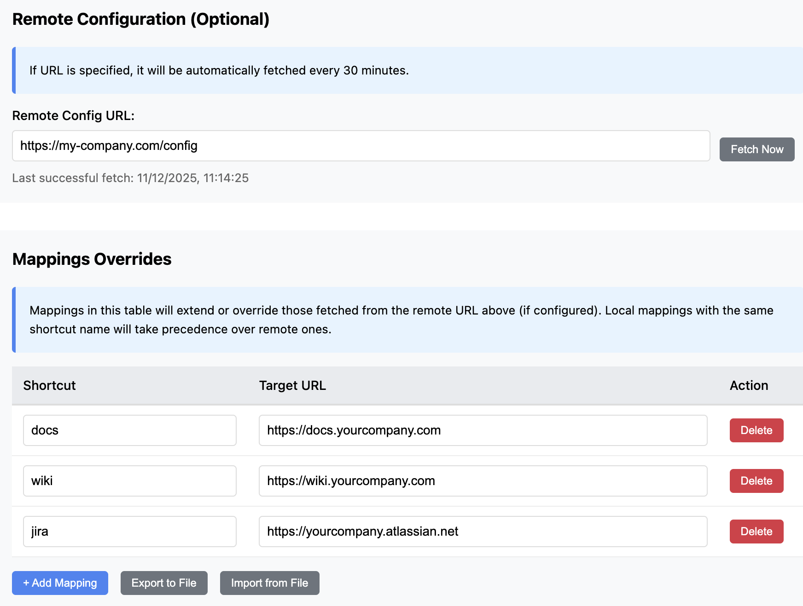

# Go Links Redirector - Chrome Extension

A Chrome extension that enables short link redirects (like `go/foo`) to predefined URLs.

## Installation

1. Clone or download this repository
2. Open Chrome and navigate to `chrome://extensions/`
3. Enable "Developer mode" (toggle in top right)
4. Click "Load unpacked"
5. Select the extension directory
6. The extension is now installed!

## Edit Configuration via Settings Page

1. Click the extension icon in your toolbar
2. Click "Edit Configuration"
3. **(Optional)** Configure a remote URL to fetch base mappings from a server. Useful for sharing configurations across a team.
4. Manage your local shortcuts in the "Mappings Overrides" table:
   - Add new mappings with "+ Add Mapping"
   - Export your local mappings to a JSON file with "Export to File"
   - Import mappings from a JSON file with "Import from File" (warns if entries will be overwritten)
5. Don't forget to click "Save Configuration" to apply changes



## Remote Configuration (Optional)

You can specify a remote config URL to fetch shortcuts from a server. This is useful for sharing configurations across a team:

1. Enter your remote config URL (e.g., `https://your-server.com/config.json`)
2. Click "Fetch Now" to load remote mappings. Later, this URL will be auto-fetched every 30 minutes.
3. Remote mappings are fetched and merged with your local overrides
4. Add local mappings in the "Mappings Overrides" table - these will **extend or override** remote ones
5. Local mappings are saved in your browser and always take precedence over remote ones

**Example remote config JSON:**
```json
{
  "docs": "https://docs.yourcompany.com",
  "wiki": "https://wiki.yourcompany.com",
  "jira": "https://yourcompany.atlassian.net"
}
```

## License

Free to use and modify for your needs.
